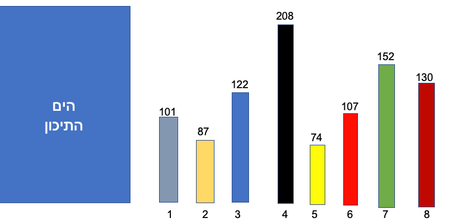

# Blocking Building

| Attribute                     | Value                                                   |
| ----------------------------- | ------------------------------------------------------- |
| Issued by                     | Bar Admoni ([@baradm100](https://github.com/baradm100)) |
| Language Limitation           | N/A                                                     |
| Runtime Complexity Limitation | O(n)                                                    |
| Space Complexity Limitation   | N/A                                                     |
| Source                        | AWS interview + Collage variant                         |

## Question

You got a list of buildings in 1 axis facing the sea.
Each building have it's own hight (in floors), you need to return for each building - which building blocks the view of the sea fro, the building's roof.

### Example

In the following example, from building `8` roof we are blocked by the `7` building, and from the `7` building roof we're blocked by the `4` building. The `4` building roof have a direct view of the sea.


Input:

```
A=[101,87,122,208,74,107,152,130]
```

Output:

```
Output=[0,1,0,0,4,4,4,7]
```
